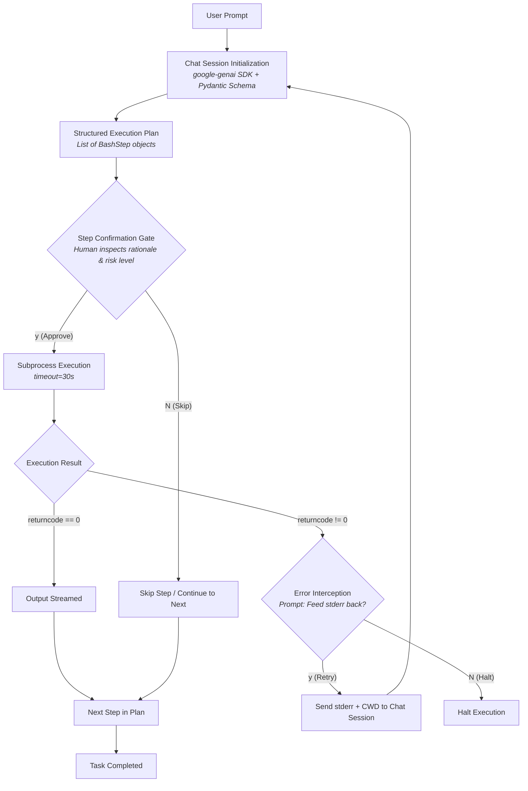

# Agent Loop: Schema-Enforced CLI Agent

A deterministic, human-in-the-loop bash execution agent built with **Python**, **Google GenAI SDK**, and **Pydantic**. Translates natural language requests into type-safe execution plans with stateful error recovery.

---

## 💡 Architectural Rationale & Design Philosophy

Most LLM agents fail in production because they rely on unconstrained text output, lack execution boundaries, or break when subshell commands fail. This project addresses those core failure modes directly:

1. **Type-Safe Schema Enforcement (`pydantic`):** Instead of parsing raw text with fragile regular expressions, the agent uses `types.GenerateContentConfig(response_schema=BashExecutionPlan)` to force strict JSON structured outputs.
2. **Human-in-the-Loop Safety Gate:** Planning is strictly decoupled from execution. Every generated command includes an `is_safe` risk assessment and rationale, requiring explicit user confirmation (`y/N`) before running.
3. **Stateful ReAct Replanning Loop (`client.chats.create`):** When a command fails, `subprocess` captures `stderr` and `returncode`. The error is routed back into an active chat context, allowing the model to re-evaluate and rewrite the remaining execution plan.
4. **Flat Control Loop:** Uses an outer `while True` control loop rather than recursive function calls, preventing stack overflows and maintaining clean memory frames.

---

## 🏗️ System Architecture



---

## ⚙️ Engineering Principles

| Pillar | Implementation |
| :--- | :--- |
| **Type-Safe Determinism** | Uses Pydantic `BaseModel` schemas passed directly to Gemini's structured output configuration to guarantee valid plan formatting. |
| **Human-in-the-Loop Safety** | Decouples plan generation from process execution. Demands explicit terminal authorization before running system calls. |
| **Self-Healing ReAct Loop** | Intercepts non-zero return codes and forwards `stderr` outputs into the persistent chat session to trigger context-aware replanning. |
| **Flat Stack Memory** | Manages loop state imperatively to prevent recursive call stack growth during multi-pass debugging. |

---

## 🚀 Quick Start

1. **Clone Repository & Setup Environment:**
   ```bash
   git clone [https://github.com/your-username/agent_loop.git](https://github.com/your-username/agent_loop.git)
   cd agent_loop
   python3 -m venv venv
   source venv/bin/activate
   ```

2. **Install Dependencies:**
   ```bash
   pip install -r requirements.txt
   ```

3. **Configure API Key:**
   ```bash
   echo "GEMINI_API_KEY=your_gemini_api_key_here" > .env
   ```

4. **Run the Script:**
   ```bash
   python3 agent_loop.py
   ```

---

## 🚨 Known System Limitations

To maintain production awareness, the following runtime boundaries apply:

* **Subshell Directory Isolation:** Commands execute via `subprocess.run(..., shell=True)` inside child subshells. Directory navigation using `cd` does not persist across steps unless handled via process-level calls (`os.chdir`).
* **Non-Interactive Stream Restrictions:** Interactive CLI commands requiring continuous TTY input (such as `nano`, `sudo`, or SSH logins) will time out after 30 seconds due to non-interactive stream redirection.
* **Context Window Accumulation:** Extended self-healing loops append messages to active chat memory, incrementally increasing token counts and response latency during deep recovery sessions.

---

## 📜 License

Distributed under the MIT License.